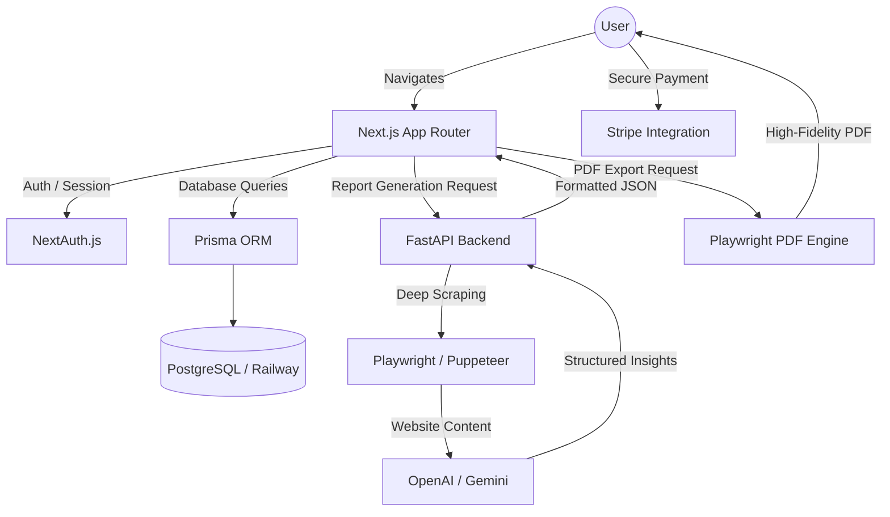

# 🚀 Local Insight AI

> **Transforming raw local business data into high-impact, actionable intelligence.**


---

## 🎯 Business Impact & Core Mission

Local Insight AI is an enterprise-grade audit platform designed to help local businesses dominate their digital markets. By ingesting raw website structures and Google Reviews, the system distills unstructured data into strategic business intelligence and visually stunning, white-labeled PDF reports. 

We solve the "data overload" problem for agencies and business owners by turning qualitative feedback into quantifiable "Quick Wins," driving immediate ROI, improving online sentiment, and delivering targeted local SEO tracking.

## 🏗️ System Architecture

Our platform leverages a decoupled, high-performance architecture optimized for extreme processing speed, horizontal scalability, and high-fidelity data extraction at scale.



## 🧠 Deep Dive: Engineering Challenges

### 1. High-Fidelity Server-Side PDF Generation
**The Hurdle**: Generating dynamic, brand-consistent PDF reports that preserve modern CSS (gradients, complex charts, responsive flexbox layouts) across serverless environments. Standard conversion libraries typically failed to render our rich, data-driven UI structures accurately.

**The Solution**: I engineered a custom **Playwright-based rendering pipeline**. By launching a headless browser exclusively server-side (utilizing optimized Chromium binaries), the system generates a virtual "live" instance of the report at a targeted 2x scale. This guarantees pixel-perfect retention of every CSS micro-interaction, chart, and agency white-label element before flattening the DOM layer into a finalized, high-quality PDF payload.

### 2. Contextual Data Extraction from Diverse Web Structures
**The Hurdle**: Extracting high-signal business context (tone, services, operating hours) from millions of unpredictable DOM trees and website designs without breaking the scraper or feeding "junk" artifacts into the upstream LLM pipelines.

**The Solution**: I architected a robust **Two-Tier Intelligence Scraper**:
- **Tier 1 (Structural)**: Puppeteer aggressively parses the target DOM, identifying and isolating high-value semantic elements (H1-H3s, navigational link arrays, and footer metadata).
- **Tier 2 (Semantic)**: A deterministic heuristic text-processing layer combined with LLM-driven sanitization cleans the raw HTML. This transforms unstructured web noise into a standardized, machine-readable JSON business profile. This isolation mechanism ensures our downstream AI insights always remain strictly grounded in factual website data.

## 🛡️ Security & Scalability

- **NextAuth Session Management**: Robust JWT-based authentication ensuring secure, stateless user sessions across the distributed frontend cluster.
- **Strict Environment Isolation**: Sensitive IP (OpenAI keys, Stripe secrets) and database connection strings are rigorously confined to isolated server-side execution environments, perpetually protected from the client bundle.
- **Serverless Chromium Optimization**: Deployed the scraping and PDF engines utilizing serverless-compatible Chromium binaries (`@sparticuz/chromium`), slashing infrastructure costs while allowing virtually infinite horizontal scaling capabilities for concurrent report generation.
- **Prisma Connection Pooling**: Actively tuned our database connection manager to reliably handle rapid traffic spikes during batch audit jobs without introducing deadlocking overhead to PostgreSQL.

## 🚀 Quick Start / Local Setup

Follow these steps for a frictionless path to spinning up the local development environment:

```bash
# 1. Clone the repository
git clone <repository-url>
cd AIINSIGHTSNEW

# 2. Install Frontend Dependencies
cd frontend
npm install

# 3. Install Backend Dependencies (Requires Python 3.8+)
cd ../backend
pip install -r requirements.txt

# 4. Set up Environment Variables
# Map the provided templates to your local environment configuration
cp frontend/.env.example frontend/.env.local
cp backend/.env.example backend/.env

# 5. Initialize the Database
cd ../frontend
npx prisma generate
npx prisma migrate dev

# 6. Start the Application Microservices
# Terminal 1 - Boot the FastAPI Backend engine
cd ../backend
python -m uvicorn app.main:app --reload --port 8000

# Terminal 2 - Boot the Next.js Frontend server
cd ../frontend
npm run dev
```

> **Developer Note:** Access the primary application at `http://localhost:3001` to view your live local configuration. Ensure your local PostgreSQL or SQLite instance is running before initiating Prisma commands.

---
*Architected and developed with a focus on clean code, scalable infrastructure, and undeniable business value.*
